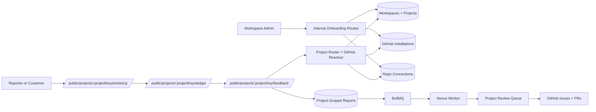

# AI-DevOps Nexus Roadmap

## Goal

Build Nexus as a self-hostable internal engineering intelligence platform that ingests high-signal internal reports, normalizes context, and progressively automates issue creation, reproduction, and verified fixes.

## Guiding Principles

- Ship the ingestion backbone before the autonomous fix pipeline.
- Treat deterministic reproduction as the main technical risk.
- Keep security boundaries explicit from day one.
- Require human review for all AI-generated GitHub artifacts in v1.
- Prefer simple, observable service boundaries over early optimization.

## Delivery Phases

Status legend:

- `[x]` complete
- `[-]` in progress or partially complete
- `[ ]` not started

## Milestone Board

### Done

- [x] Phase 0 foundation baseline is operational.
- [x] Phase 1 ingestion and triage backbone is operational.
- [x] GitHub draft sync supports both PAT and GitHub App auth models.
- [x] Secret and PII redaction is in place before persistence and drafting.
- [x] HAR replay normalization, replay jobs, and Playwright request-context execution are live.
- [x] Signed artifact downloads and service-token protected internal routes are live.
- [x] Committed end-to-end smoke automation is live, including safe GitHub test-repo routing.

### Next

- [x] Continue Phase 7 MCP developer context.
- [x] Publish dedicated MCP setup docs and learn-more hosting routes.
- [x] Add a report-index backfill path and CI smoke coverage for developer context.
- [x] Start Phase 8 shadow-suite retention and distribution.
- [x] Add a review gate before GitHub writes are treated as production-ready workflow.
- [x] Plan Phase 9 customer onboarding and repository connection.
- [x] Define workspace, project, and repository-connection data model.
- [x] Refactor GitHub auth toward runtime project-scoped GitHub App resolution.
- [x] Ship the hosted feedback widget and embed bootstrap, and continue hardening the project-scoped submission flow.
- [x] Add broader operator workflows for repo-connection editing and support-oriented customer operations.
- [x] Promote the new replay browser-context smoke into regular CI coverage where Playwright browser binaries are available.
- [x] Time-box and validate the under-60-second customer handoff target end to end.
- [x] Keep signed-session hosted-feedback access as the v1 customer access model and defer broader customer auth.
- [x] Add a session-scoped customer dashboard for hosted feedback status, ownership hints, and prioritization visibility.

### Blocked

- [x] Agentic PR generation now requires approved replay-backed validation before promotion when replay evidence exists.
- [x] MCP developer context now exposes compact ownership, clustering, and reproduction summaries plus SDK-backed smoke coverage.
- [x] Shadow-suite distribution now has retained replay routes, scheduler entrypoint, worker execution, Compose worker support, and Terraform packaging.

### [x] Phase 0: Foundation

Objective: establish a self-hostable baseline and the contracts every later phase depends on.

Deliverables:

- [x] TypeScript Fastify gateway with health checks and authenticated ingestion endpoints.
- [x] Docker Compose topology for local and self-hosted development.
- [x] Environment variable contract and startup validation.
- [x] Initial database schema for reports, artifacts, jobs, issue links, and audit logs.
- [x] Basic structured logging and audit event writing.

Exit criteria:

- [x] A local operator can boot PostgreSQL, Redis, and the gateway with one command.
- [x] The gateway accepts validated webhook payloads and emits audit/job events.

### [x] Phase 1: Ingestion And Triage Backbone

Objective: accept reports from Slack, observability tools, and the future browser extension and normalize them into a canonical feedback model.

Deliverables:

- [x] Slack reaction and event endpoint.
- [x] Observability webhook endpoint for Sentry, Datadog, and New Relic style payloads.
- [x] Canonical feedback schema and persistence model.
- [x] Initial impact score model using source, severity, and frequency hints.
- [x] Queue-backed triage job creation.

Exit criteria:

- [x] A bug reaction or telemetry event becomes a stored report and queued triage job.

### [x] Phase 2: Redaction, Classification, And Issue Creation

Objective: turn stored reports into safe, structured engineering issues.

Deliverables:

- [x] Multi-layer secret and PII scrubbing.
- [x] Intent classification and normalization pipeline.
- [x] GitHub issue draft creation flow.
- [x] Review gate before any GitHub write.
- [x] Deduplication v1 using deterministic heuristics and full-text similarity.

Exit criteria:

- [x] An internal report can be converted into a proposed GitHub issue without leaking sensitive data.

### [x] Phase 3: Browser Extension MVP

Objective: capture the state developers need for deterministic reproduction.

Deliverables:

- [x] Explicit screen recording capture.
- [x] Console log capture.
- [x] localStorage and sessionStorage snapshots.
- [x] HAR and request metadata capture.
- [x] Client-side first-pass redaction and bounded upload flow.

Exit criteria:

- [x] QA or PO can submit a captured artifact bundle attached to a report.

### [x] Phase 4: Reproduction Spike And Runner

Objective: prove that captured sessions can be replayed reliably enough to support verified fixes.

Deliverables:

- [x] HAR normalization pipeline.
- [x] Synthetic token and auth-refresh handling strategy.
- [x] Isolated Playwright execution service.
- [x] Repeated fail-before and pass-after validation policy.
- [x] Artifact-based reproduction job model.

Exit criteria:

- [x] Nexus can show consistent failure on a buggy build for at least one representative report class.

### [x] Phase 5: Semantic Intelligence

Objective: reduce noise and improve code ownership mapping.

Deliverables:

- [x] pgvector-backed semantic deduplication.
- [x] pgvector-backed embedding schema, nearest-neighbor repository scaffold, and ingestion-time embedding persistence.
- [x] Historical linkage to recent issues and closed PRs via report history routes and prepared agent context.
- [x] Repository-aware code ownership mapping.
- [x] Impact score refinement using recurrence and breadth.

Exit criteria:

- [x] Similar reports cluster together and suggest likely owning code areas.

### [x] Phase 6: Agentic PR Pipeline

Objective: generate fix proposals only when a trustworthy reproduction exists.

Deliverables:

- [x] Agent-task intake, execution records, repository worktree preparation, pluggable agent command handoff, stronger agent output contracts, and execution inspection routes are live.
- [x] Draft PR generation integration is live for configured repositories, and PR opening is blocked pending approval and explicit promotion.
- [x] Fix validation now includes replay-backed verification against stored HAR evidence, a dedicated persisted replay-comparison model, execution read routes, a persisted validation policy record, and explicit execution closeout gating.
- [x] PR metadata and audit trail.
- [x] Human approval workflow.

Exit criteria:

- [x] Nexus can produce a draft PR with linked evidence and validation status.

### [x] Phase 7: MCP Developer Context

Objective: surface active issue intelligence directly in the IDE.

Deliverables:

- [x] MCP server with active issues by file or service, including persisted repository file-path and service indexing.
- [x] Issue context tool returning logs, artifacts, triage summaries, and inline previewable artifact context.
- [x] Async reproduction status lookup.
- [x] Linked observability context.
- [x] Hosted learn-more pages for the PRD and developer workbench preview.
- [x] Backfill utility and CI smoke coverage for persisted developer-context indexing.
- [x] Compact engineering summary for ownership, clustering, and reproduction context plus MCP smoke coverage.

Exit criteria:

- [x] Developers can query active issue context from the IDE without leaving their editor.

### [x] Phase 8: Shadow Suite And Distribution

Objective: turn validated reproductions into durable regression coverage and make deployment portable.

Deliverables:

- [x] Shadow test library management.
- [x] Continuous replay against staging or preview environments.
- [x] Supported Docker Compose distribution.
- [x] Terraform packaging once runtime topology stabilizes.

Exit criteria:

- [x] Teams can self-host Nexus and continuously run retained reproductions in shadow mode.

### [x] Phase 9: Customer Onboarding And Repository Connection

Objective: make Nexus easy for external teams to adopt by connecting a GitHub repository through a GitHub App and submitting high-signal feedback through a hosted surface.

Deliverables:

- [x] Workspace and project model with project-scoped report routing.
- [x] GitHub App-based repository connection flow.
- [x] Runtime repository-to-installation resolution for GitHub writes.
- [x] Hosted feedback widget, embed bootstrap, and public submission surface for lightweight user feedback.
- [x] Project-scoped review queue before GitHub issue creation or downstream agent actions, including operator-facing queue controls and assignment workflows.
- [x] Multi-repository project support with active/default repository resolution and strict hosted-feedback task targeting.
- [x] Operator-facing project operations and onboarding surface for installs, repo scope, widget handoff, and service identity lifecycle.
- [x] Replay execution now prefers full browser-context restoration with request-context fallback.
- [x] Session-scoped customer dashboard for hosted feedback visibility using the same signed widget session model.
- [x] Customer-visible ownership and refined impact hints for hosted feedback prioritization.

Recent Phase 9 progress:

- Signed project-scoped widget sessions now gate both `/public/projects/:projectKey/widget` and `/public/projects/:projectKey/embed.js`, and the public feedback submission path now requires the same short-lived token.
- Internal onboarding can now mint GitHub App install links via `POST /internal/workspaces/:workspaceId/github-app/install-link`, and `/github/app/install/callback` persists installation metadata plus project repo bindings when repository access matches.
- The operator review queue now exposes assignment health, queue aging metrics, and per-report review activity pulled from persisted audit events.
- Project repo routing now supports multiple active connections, explicit default reassignment, project-operations summaries, and strict customer-review repository scoping before GitHub issue creation or agent-task execution.
- Service identities are now durable lifecycle-managed principals with list, create, rotate, and revoke routes, and the onboarding console exposes those flows directly for operators.
- A dedicated replay browser-context smoke now validates execution-mode selection when Playwright browser binaries are installed while preserving request-context fallback behavior elsewhere.
- The onboarding console now supports project-key lookup, repo-connection create and edit flows, and support-readiness snapshots that surface public widget paths, review-queue routing, and recent hosted feedback state from one operator page.
- The new `/learn/support-ops` page gives operators a dedicated long-lived support surface for project-key lookup, live readiness checks, public route verification, and queue follow-up.
- CI now installs Chromium before running the replay browser-context smoke, and `npm run e2e:customer-handoff` enforces a tighter 30-second total budget with stage-by-stage SLOs for bootstrap, widget readiness, feedback submission, queue visibility, and draft readiness.
- The hosted feedback public surface now includes `/public/projects/:projectKey/dashboard`, a session-scoped customer dashboard that reuses the signed widget token and exposes submission status, ownership hints, and refined impact bands without broadening access scope.
- The v1 customer access decision is now explicit: keep signed-session distribution and defer broader customer auth until multi-user customer identity becomes necessary.

Phase 9 architecture snapshot:

Exit criteria:

- [x] A new customer can connect a repository without creating a PAT.
- [x] A user can submit actionable feedback in under 60 seconds.
- [x] Nexus routes the report to the correct project and repository scope before any GitHub write.
- [x] Customer-originated issue and PR generation remain review-gated.

### [-] Phase 10: Customer Visibility And Triage Policy

Objective: make hosted feedback legible to customers and operators after submission while turning heuristic ownership and impact into clearer policy.

Deliverables:

- [x] Session-scoped customer dashboard for hosted feedback using the existing signed widget session model.
- [x] Explicit v1 access decision to keep signed-session distribution and defer broader customer auth.
- [x] Customer-visible ownership and refined-impact hints surfaced from existing triage services.
- [ ] Workspace-configurable ownership and prioritization policy beyond heuristic inference.
- [ ] Durable customer or account views that outlive a single signed widget session.

Exit criteria:

- [x] A customer can inspect the status of submissions from the current hosted-feedback session without seeing unrelated project data.
- [ ] Ownership and prioritization policy become operator-configurable and auditable.
- [ ] Broader customer identity or account access is only introduced when session-scoped access is no longer sufficient.

## Current Sprint

Current focus has moved beyond the original foundation sprint. The initial sprint items are complete:

1. [x] Create the roadmap and execution baseline.
2. [x] Scaffold the gateway service.
3. [x] Define environment and container contracts.
4. [x] Add initial webhook routes and validation.
5. [x] Add database bootstrap SQL for core entities.

Current execution emphasis:

1. [x] Mark Phase 9 complete and shift the active workstream toward customer visibility after submission.
2. [x] Keep signed-session hosted-feedback access as the v1 customer access model and defer broader customer auth.
3. [x] Add a session-scoped customer dashboard that surfaces current hosted-feedback status.
4. [x] Expose ownership and refined impact hints in the customer-facing dashboard.
5. [ ] Turn ownership and prioritization from heuristics into workspace-configurable policy.
6. [ ] Expand customer visibility from single-session dashboards into durable customer or account views only if the access model demands it.

## Open Questions

These do not block initial scaffolding, but they do affect later architecture:

1. GitHub auth model for v1 has been answered as both PAT-backed service and GitHub App support.
2. Observability ingestion now supports Sentry, Datadog, and New Relic, but ownership mapping and prioritization policy are still open.
3. Does the browser extension need Chrome-only support at first, or Chromium plus Firefox?
4. Should the first reproduction spike target a web frontend with stable staging auth, or a synthetic demo app?
5. Should Phase 9 start with one repository per project, or support multiple repositories from the first slice?
6. When does the session-scoped customer dashboard stop being sufficient and require durable customer or account access?
7. What operator-configurable ownership and prioritization rules should outrank the current heuristic inference model?

## Success Metrics

- Gateway startup time under 10 seconds in local Compose.
- Webhook request validation failure rate visible in logs.
- Triage job creation latency under 500 ms from accepted ingestion.
- Zero known sensitive value leakage in redaction tests.
- [x] First deterministic replay achieved before autonomous PR work begins.
- [x] Initial Phase 9 slice validated locally: onboarding records plus a project-scoped hosted-feedback report persisted with `project_id` on 2026-03-08.
- [x] Hosted feedback now queues for internal review before GitHub issue creation, with dedicated review endpoints and agent-task gating.
- [x] Operator review is now exercised by `e2e:hosted-feedback-review`, with queue assignment actions, and stronger review surfaces are available at `/learn/review-queue`, `/learn/onboarding`, and `/learn/support-ops`.
- [x] New customer repository connection can now start from a GitHub App install link and callback, with broader operator-facing onboarding and support workflows available in the learn surfaces.
- [x] Customer feedback submission completed in under 60 seconds through the hosted intake surface, with `npm run e2e:customer-handoff` currently enforcing a stricter 30-second total budget plus stage SLOs.
- [x] Customers can now inspect session-scoped hosted-feedback status through `/public/projects/:projectKey/dashboard`, including current review state, refined impact, and ownership hints.